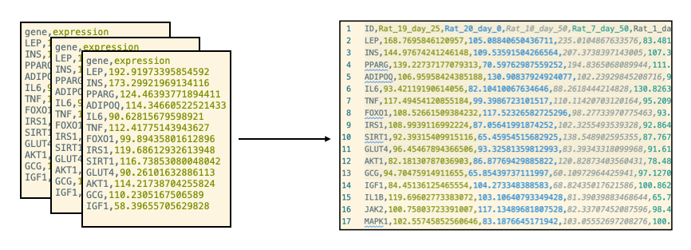
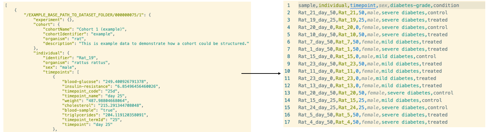

# semares_preprocessing
scripts to prepare files for semares workflows!

## Join Table

This script can be used to join input data on a specific column and return a matrix. The matrix header can be renamed based on metadata input.

### Example
```bash
python join_table.py --metadata  ./examples/metadata_transcriptomics_adjusted.json --config  ./config/data_table_config.json --files ./examples/transcriptomics/Rat_25_day_0/gene_expression_0.csv ./examples/transcriptomics/Rat_24_day_0/gene_expression_0.csv ./examples/transcriptomics/Rat_23_day_0/gene_expression_0.csv
```



### Configuration
You can find a valid configuration file [here](./config/data_table_config.json).

```json
"join": {
    "columns": [
        "gene",
        "protein"
    ],
    "name": "ID"
},
```
**columns:** list of column names (synonyms) which can be used for data join. Just one of the names will be selected. But the list ensures that the script can be used with different input scenarios. E.g. in one experiment you want to join on `gene` name and in another experiment you want to join on `protein` name.
The resulting column name will be `ID`

```json
"columns": [
    {
        "maps": [
            {
                "name": "map_1",
                "object_type": "sample",
                "field": [
                    "name"
                ]
            },
            {
                "name": "map_2",
                "object_type": "individual",
                "field": [
                    "diabetes-grade"
                ]
            }
        ],
        "name": "{map_1} ({map_2})",
        "input": [
            "abundance",
            "expression"
        ]
    }
]
```
If the input files have same column names, it is necessary to rename the columns. The column to rename is specified in `input`. `input` accepts a list of synonyms. The `name` parameter specifies a pattern for the output column name. `map_1` and `map_2` will be replaced as specified in the `maps` section. The `maps.name` parameter is a arbitrary variable name which can be used in the `name` pattern. With `object_type` and `field` you can specify which metadata should be used for mapping. `field` is a list of synonyms.

## Metadata JSON to table

The `metadata2table` script transforms a json metadata file, returned by semares, to a table file which can be used by a followup script.

### Example
```bash
python metadata2table.py --metadata ./examples/metadata_transcriptomics_adjusted.json --config ./config/meta_table_config.json --pathes ./examples/transcriptomics/Rat_25_day_0/gene_expression_0.csv,./examples/transcriptomics/Rat_24_day_0/gene_expression_0.csv,./examples/transcriptomics/Rat_23_day_0/gene_expression_0.csv
```



### Configuration
You can find a valid configuration file [here](./config/meta_table_config.json).

```json
{
    "field": [
        "identifier"
    ],
    "object_type": "individual",
    "header_name": "individual"
},
{
    "field": [
        "timepoints",
        "$TIMEPOINT",
        "timepoint_termId"
    ],
    "object_type": "individual",
    "header_name": "timepoint"
},
```
The `object_type` parameter specifies from which object type the metadata comes from. E.g. if the dataset originated from a sample, semares returns metadata from the sample, experiment and from the cohort and individual if linked to the sample. The `header_name` is the output name of the column. Whereas `field` specifies from which field the value should be taken. A list of values allows to select nested data. The `$TIMEPOINT` key is a placeholder. If this key is used, the timepoint is selected based on the timepoint connected to the sample (`sample.associations.timepoint`).